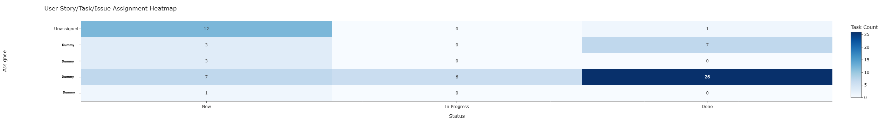
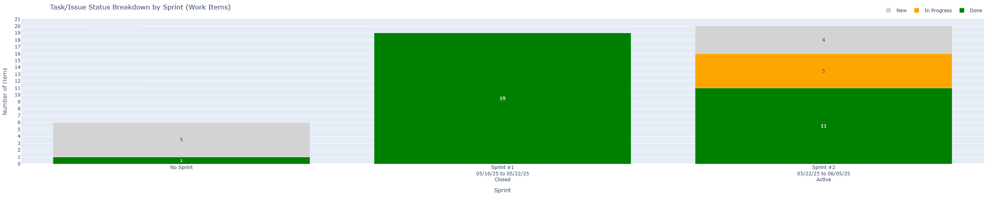
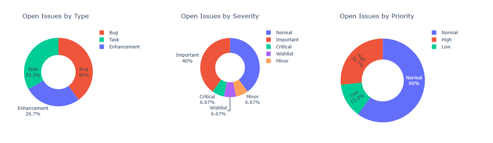

# Taiga Dashboard

A python application using Plotly and Flask that serves a visual dashboard for your [Taiga](https://taiga.io/) project. It is designed to provide insightful metrics into your project without worrying about the details.

## Widgets

The dashboard currently has the following widgets/plotly graphs:
- Epic Progress Bar
- User Story Status Breakdown (Requirement Items)
- Task/Issue Status Breakdown (Work Items)
- Assignment Heatmap
- Creator Heatmap
- Tag Cloud + Bar Chart
- Open Issues Donut Charts
- Blocked Items Table

## Output

## Sample Graphs

